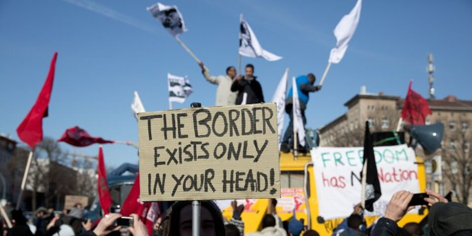

<!--

author: Moritz Riemann
email:  riemann@philsem.uni-kiel.de
version: 0.1
language: en
narrator: UK English Female

\-->

# Flucht und politische Theorie

**Vortrag für die Seebrücke am 06.11.2025**

Moritz Riemann, M.A. (Dr. des.)

Kontakt: riemann@philsem.uni-kiel.de

## Ein paar Grundprobleme

### Verhältnis von Flucht und Migration

Migration ist eine gesellschaftliche Realität und Normalität. Flucht und Vertreibung als Formen prekärer und erzwungener Migration sind existenzielle, soziale, ökonomische, rechtliche und politische Ausnahmezustände, die nicht selten mit einer völligen Entrechtung und Immobilisierung der betroffenen Personen einhergehen.

Dennoch ist es durch die zahlreichen diskursiven, phänomenalen und nicht zuletzt politischen Überlappungen nicht möglich, kategorial zwischen Fluchtmigration und freiwilliger Wirtschaftsmigration zu unterscheiden, insbesondere dann nicht, wenn man den Einwanderungsaspekt und die Transnationalisierung der Lebensverhältnisse mitbedenkt.

Beispiel: Fachkräftemigration wird befördert, während Flüchtlinge in Internierungslagern für die Verfahrensprüfung auf griechischen Inseln interniert werden. Beides wird medial mal als Migration verschlagwortet oder im sog. "Stadtbild" als illegale Flüchtlinge stereotypisiert.

### Humanitäres und politisches Asyl

Der Anspruch eines Menschen auf der Flucht oder allgemeiner von *people on the move* besteht nicht allein im physischen Überleben, sondern im (Wieder-)Erlangen eines selbstbestimmten Lebens. Die Basis für diesen Prozess bildet die Herstellung einer Sympolitizität, das heißt einer ethisch-politischen Wechselbeziehung zwischen Heimatlosen und Beheimateten. 

Rescue und Autonomy sind dabei die beiden leitenden Prinzipien des Flüchtlingsschutzes (Owen 2019). Ebenso gilt es auf die humanitäre und die politische Dimension des Asyls hinzuweisen.

Daraus folgt, dass die Aufgabe des Flüchtlingsschutzes sich nicht in der Sicherung des Überlebens der Geflüchteten erschöpft, sondern dass sie die Wiederherstellung von privater und politischer Autonomie zum Ziel haben muss, und damit die Inklusion in die Modi der gesellschaftlichen Selbstverständigung.

Die aktuellen Entwicklungen, insbesondere der GEAS-Reformen zeigen allerdings, dass Personen im Asylverfahren die gesellschaftliche Teilhabe und damit ihre Selbstbestimmung weiter erschwert werden soll.

### Verhältnis Migration und Demokratie

